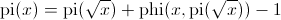
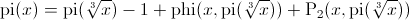
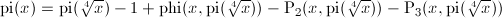

primecount
==========
primecount is a command-line program and C++ library that counts the number of primes below an integer x < 2^63. It does so by using an efficient implementation of the prime counting function pi(x) which is orders of magnitude faster than counting primes using the sieve of Eratosthenes. So far primecount offers the option to count primes using Legendre's, Meissel's and Lehmer's formulas. All pi(x) implementations are fully parallelized using OpenMP.

### Algorithms

<table>
  <tr>
    <td>Legendre's Formula:</td>
    <td></td>
  </tr>
  <tr>
    <td>Meissel's Formula:</td>
    <td></td>
  </tr>
  <tr>
    <td>Lehmer's Formula:</td>
    <td></td>
  </tr>
</table>

### How to build it
primecount depends on the author's primesieve libary (version 4.3 or later). To download, build and install the latest primesieve version on a Unix-like operating system run:
```
$ sh install_primesieve.sh
```
To build and install primecount using GNU make and the default `c++' compiler run:
```
$ make
$ sudo make install
```

### Usage Examples
```
$ primecount 10^13
$ primecount 10^14 --meissel --threads=2
$ primecount 78498 --nthprime
```

### References
1. Hans Riesel, Prime Numbers and Computer Methods for Factorization, 2nd ed., Birkhäuser, Boston, 1994.
2. Raymond Séroul, Programming for Mathematicians, Springer-Verlag, Berlin (2000), pp. 175-181.
3. R. Crandall and C. Pomerance, Prime numbers: a computational perspective, 2nd ed., Springer, New York, 2005.
4. Tomás Oliveira e Silva, Computing pi(x): the combinatorial method, Revista do DETUA, vol. 4, no. 6, pp. 759-768, March 2006
