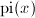
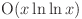
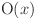
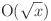
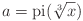
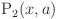
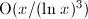
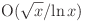
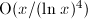

primecount
==========
primecount is a command-line program and C++ library that counts the number of primes below an integer x&nbsp;<&nbsp;2<sup>63</sup>. primecount counts primes using efficient implementations of the prime counting function  (combinatorial methods) which is orders of magnitude faster than counting primes using the sieve of Eratosthenes. So far primecount offers the option to count primes using Legendre's, Meissel's and Lehmer's formulas. All  implementations are fully parallelized using OpenMP.

### Algorithms and Complexity

<table>
  <tr>
    <td>Legendre's Formula:</td>
    <td></td>
  </tr>
  <tr>
    <td>Meissel's Formula:</td>
    <td></td>
  </tr>
  <tr>
    <td>Lehmer's Formula:</td>
    <td></td>
  </tr>
</table>

Up until the early 19th century the most efficent known method for counting primes was the sieve of Eratosthenes which has a running time of . The first improvement to this bound was Legendre's formula (1830) which uses the inclusion-exclusion principle to calculate the number of primes below x without enumerating the individual primes. Legendre's formula has a running time of  operations and uses  space. Meissel (1870) improved Legendre's formula by setting  and by adding the correction term . Meissel's formula has a running time of  operations and uses  space (my implementation uses  space). In 1959 Lehmer extended Meissel's formula and silghtly improved the running time to  operations and  space (my implementation uses  space).

### Timings

<table>
  <tr align="center">
    <td><b>x</b></td>
    <td><b>Prime Count</b></td>
    <td><b>pi_legendre(x)</b></td>
    <td><b>pi_meissel(x)</b></td>
    <td><b>pi_lehmer(x)</b></td>
  </tr>
  <tr align="right">
    <td>10<sup>10</sup></td>
    <td>455,052,511</td>
    <td>0.06s</td>
    <td>0.05s</td>
    <td>0.03s</td>
  </tr>
  <tr align="right">
    <td>10<sup>11</sup></td>
    <td>4,118,054,813</td>
    <td>0.15s</td>
    <td>0.16s</td>
    <td>0.11s</td>
  </tr>
  <tr align="right">
    <td>10<sup>12</sup></td>
    <td>37,607,912,018</td>
    <td>0.60s</td>
    <td>0.44s</td>
    <td>0.29s</td>
  </tr>
  <tr align="right">
    <td>10<sup>13</sup></td>
    <td>346,065,536,839</td>
    <td>3.26s</td>
    <td>1.84s</td>
    <td>1.18s</td>
  </tr>
  <tr align="right">
    <td>10<sup>14</sup></td>
    <td>3,204,941,750,802</td>
    <td>21.70s</td>
    <td>9.19s</td>
    <td>5.60s</td>
  </tr>
  <tr align="right">
    <td>10<sup>15</sup></td>
    <td>29,844,570,422,669</td>
    <td>196.56s</td>
    <td>60.36s</td>
    <td>31.95s</td>
  </tr>
  <tr align="right">
    <td>10<sup>16</sup></td>
    <td>279,238,341,033,925</td>
    <td>1598.14s</td>
    <td>504.72s</td>
    <td>204.33s</td>
  </tr>
  <tr align="right">
    <td>10<sup>17</sup></td>
    <td>2,623,557,157,654,233</td>
    <td>NaN</td>
    <td>NaN</td>
    <td>1475.40s</td>
  </tr>
</table>

The benchmarks above were run on an Intel Core i7-4770 CPU (4 x 3.4GHz) from 2013 using a 64-bit Linux operating system. primecount was compiled using GCC 4.8 and used 8 threads for each benchmark.

### How to build it
primecount depends on the author's primesieve libary (version 4.3 or later). To download, build and install the latest primesieve version on a Unix-like operating system run:
```
$ sh install_primesieve.sh
```
To build and install primecount using GNU make and the default `c++' compiler run:
```
$ make
$ sudo make install
```

### Usage Examples
```
$ primecount 10^14
$ primecount 10^14 --meissel --threads=2
$ primecount 10^14 --nthprime
```

### References
1. A. M. Legendre, Théorie des nombres, Third edition, Paris, 1830. Vol. 2, p. 65.
2. D. H. Lehmer, On the exact number of primes less than a given limit, Illinois J. Math. 3 (1959), pp. 381–388.
3. Hans Riesel, Prime Numbers and Computer Methods for Factorization, 2nd ed., Birkhäuser, Boston, 1994. pp. 10-38.
4. Raymond Séroul, Programming for Mathematicians, Springer-Verlag, Berlin (2000), pp. 175-181.
5. R. Crandall and C. Pomerance, Prime numbers: a computational perspective, 2nd ed., Springer, New York, 2005. pp. 152-162.
6. Tomás Oliveira e Silva, Computing pi(x): the combinatorial method, Revista do DETUA, vol. 4, no. 6, March 2006, pp. 759-768.
